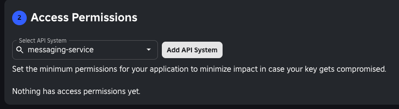
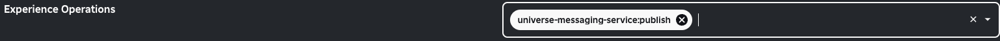

#### *by imacodr*

## Paper/Spigot Plugin to Connect Minecraft and Roblox

Ever thought: "I NEED to talk to my friends on Roblox while playing this server"
*...yeah, you probably didnt*

BUT not to worry! This plugin fixes that issue!

 Bloxxer is a cross-communication plugin that allows you to host communication between your Roblox game and your Minecraft server.
It can be useful if you want a platform with multiple different types of games and want to enable cross communication!

Bloxxer is my first plugin made soooo... if its bad... oops?

---

## Download Bloxxer

Download Bloxxer in the [Releases](https://github.com/imacodr/Bloxxer/releases) page.


Thank you and enjoy ❤️

---

## Setup Bloxxer

### Minecraft Side

1. Import the `.jar` file into your plugins folder
2. This will create a `config.yml` file for Bloxxer
3. Open the `config.yml` for Bloxxer and it should somewhat like this:
```yml
# BLOXXER
# ROBLOX - MINECRAFT CONNECTION
# by Sam Perillo (@imacodr)

#====== IMPORTANT!!!!! =======
#PLEASE SET AN API KEY FOR YOUR SERVER TO PROTECT FROM DDOS ATTACKS AND UNAUTHORIZED MESSAGES
api_key: "EXAMPLE-KEY-1411341=" # Please generate a secure key for authorization

# Your Roblox Open Cloud API Key from the console
roblox_api_key: "YOUR_KEY"

# The universe hosting the server
universe_id: 1
```
4. Join your Minecraft server. Then run `/bloxxer regenerate` to generate a new API Key for Bloxxer. **This is your MC Server Key! DO NOT SHARE**
5. Make sure you save that key somewhere safe

### Roblox Side
1. Go to [Roblox Creator Dashboard](https://create.roblox.com/dashboard)
2. Go to Open Cloud and API Keys
3. Create a new API Key
4. Add the `messagingservice` API System (Photo below)



5. Pick an experience to use Bloxxer and add this Experience Operation (Photo below)



6. Set IP security to either your MC server IP Address or `0.0.0.0/0` if you don't care
7. Create the API Key and copy that
8. Add that to the MC server `config.yml`
9. Go to the experience you selected for Bloxxer and copy the `Universe ID`
10. Put that in `config.yml`

---

*Still In-Development*